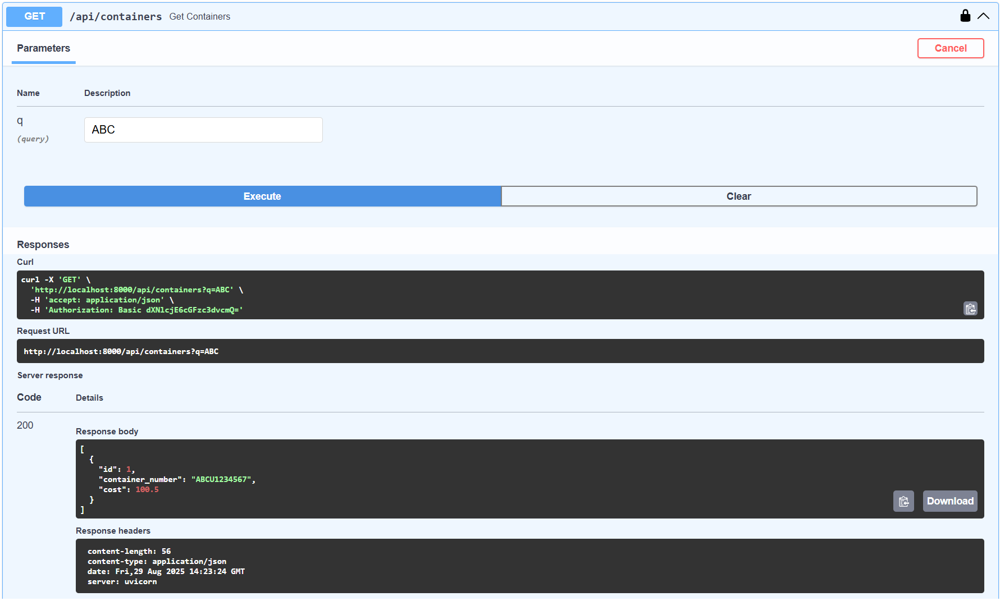
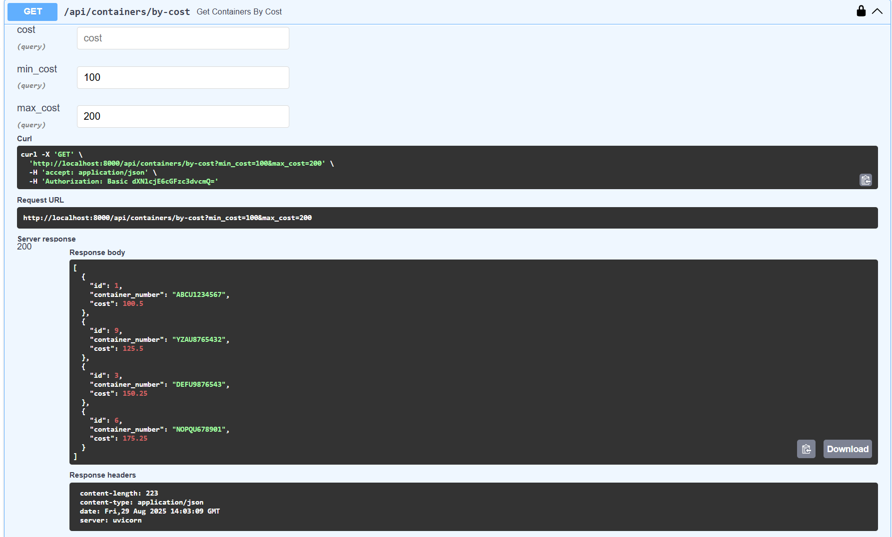
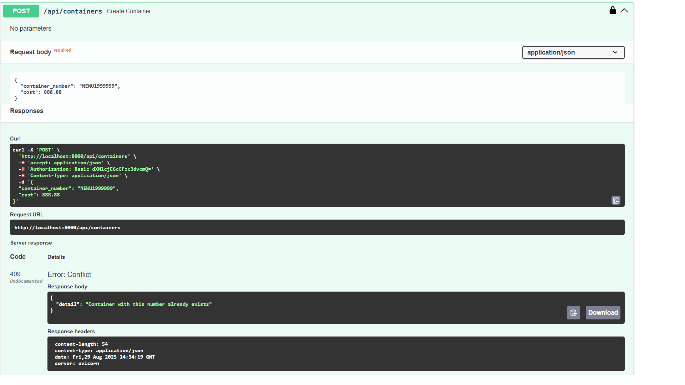

# Контейнерный сервис ATK

Минимальный сервис для работы с контейнерами с использованием MySQL и FastAPI.

## Требования
- Docker
- Python 3.7+
- pip

## Быстрый старт

1. Убедитесь, что Docker запущен

2. Клонируйте репозиторий

3. Создайте файл `.env` в корне проекта:
DB_HOST=localhost
DB_DATABASE=atk
DB_USER=user
DB_PASSWORD=userpassword

4. Запустите контейнер с MySQL:
```bash
docker-compose up -d

5.Установите зависимости Python:
pip install -r requirements.txt

6.Запустите приложение:
uvicorn app.main:app --reload

7.Откройте в браузере: http://localhost:8000/docs
Авторизация
Для доступа к API используйте:

Логин: user1, user2 или user3

Пароль: password

Тестирование эндпоинтов
1. Поиск контейнеров (GET /api/containers)
Без параметров:

Возвращает первые 50 контейнеров

Пример: GET /api/containers

С параметром q (поиск по подстроке):

Ищет контейнеры, содержащие подстроку в номере

Примеры:

GET /api/containers?q=ABC - поиск по "ABC"

GET /api/containers?q=U12 - поиск по "U12"

GET /api/containers?q=5 - поиск по цифре 5



2. Поиск по стоимости (GET /api/containers/by-cost)
По точной стоимости:

Параметр: cost

Пример: GET /api/containers/by-cost?cost=100.50

По диапазону:

Параметры: min_cost и/или max_cost

Примеры:

GET /api/containers/by-cost?min_cost=100&max_cost=200

GET /api/containers/by-cost?min_cost=250

GET /api/containers/by-cost?max_cost=150




3. Добавление контейнера (POST /api/containers)
Успешное добавление:

{
  "container_number": "NEWU1999999",
  "cost": 888.88
}

Ошибки:

Дубликат номера: "Container with this number already exists"

Неверный формат номера: "Container number must be in format: ABCU1234567"

Отрицательная стоимость: "ensure this value is greater than 0"




Примеры тестирования через Swagger UI
Откройте http://localhost:8000/docs

Нажмите "Authorize" и введите логин/пароль

Тестируйте эндпоинты:

GET /api/containers:

Нажмите "Try it out"

В поле q введите значение для поиска (или оставьте пустым)

Нажмите "Execute"

GET /api/containers/by-cost:

Нажмите "Try it out"

Заполните один или несколько параметров

Нажмите "Execute"

POST /api/containers:

Нажмите "Try it out"

В поле "Request body" введите JSON

Нажмите "Execute"

Управление контейнерами
Просмотр логов MySQL:

docker-compose logs mysql

Остановка контейнеров:

docker-compose down

Полное удаление с данными:

docker-compose down -v